# Notility App


Notility App is a user-friendly application designed for efficient note-taking and collaboration. It allows multiple users to create, share, and collaboratively edit notes in real time.

## Features

- User Authentication
- Create, Edit, and Delete Notes
- Share Notes with Collaborative Editing
- Role-Based Access Control
- Responsive Design

## Screenshots

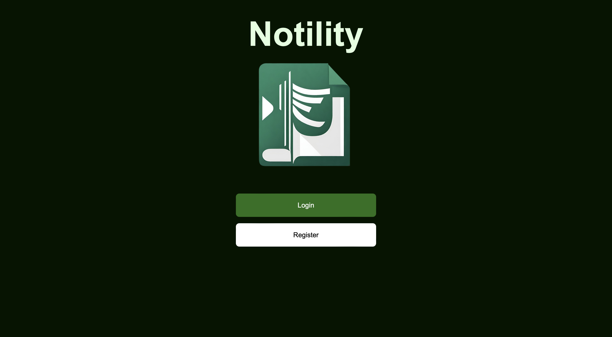

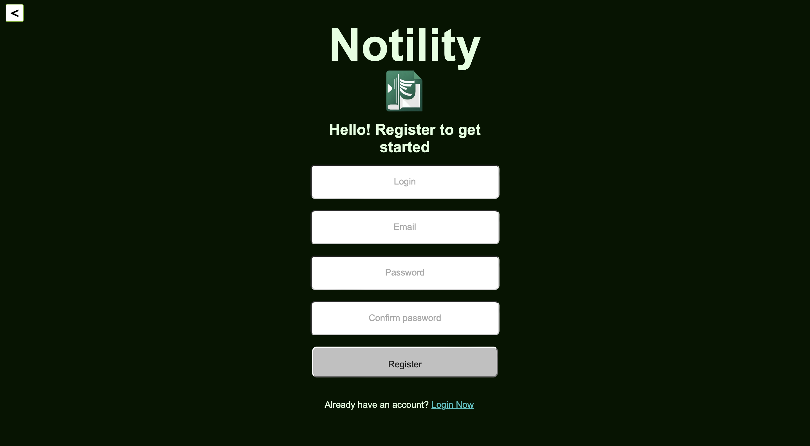

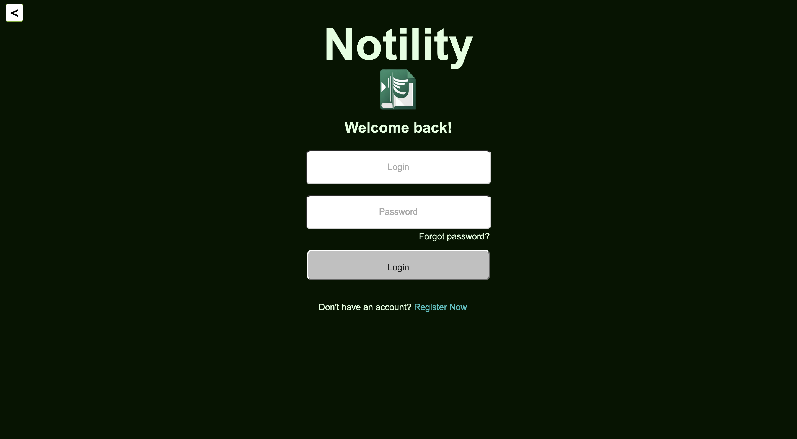

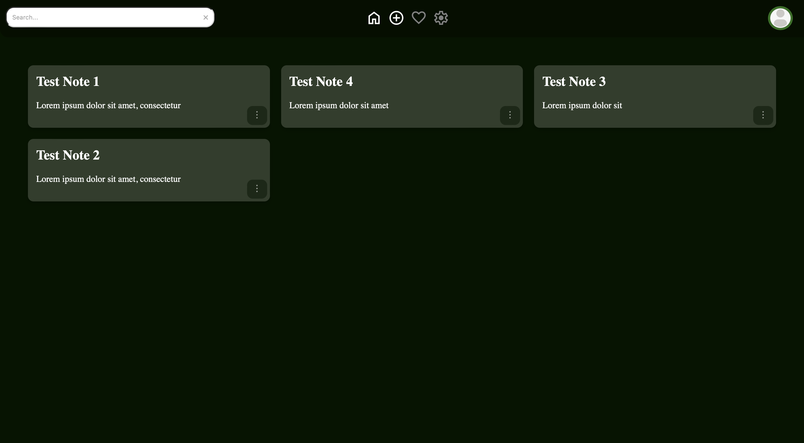

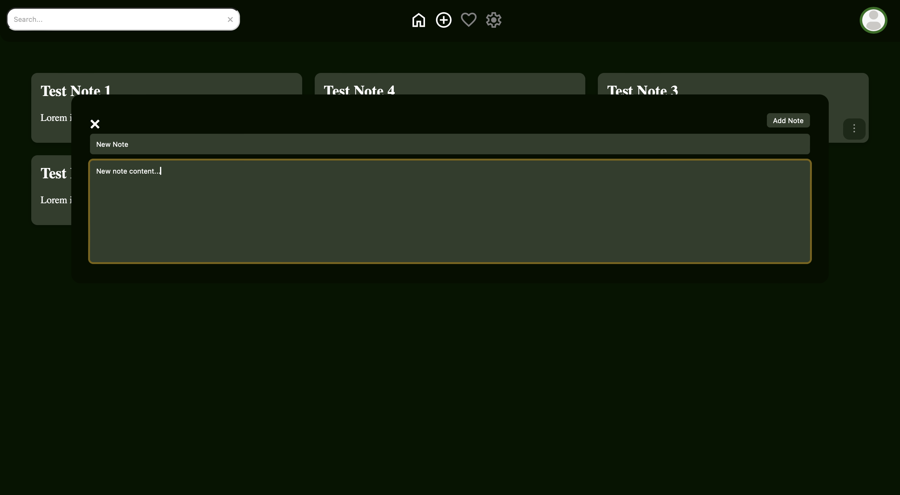

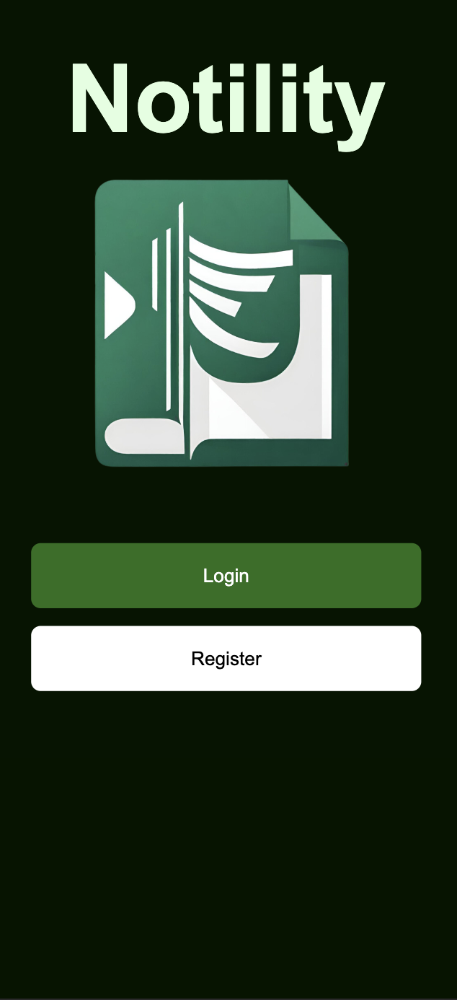

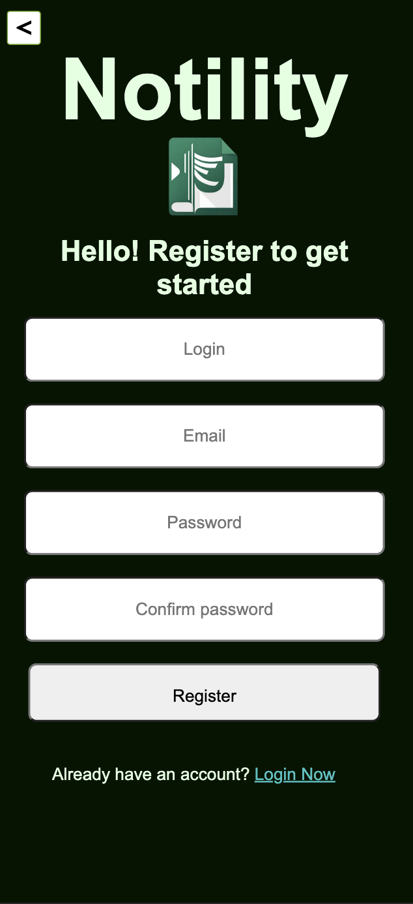

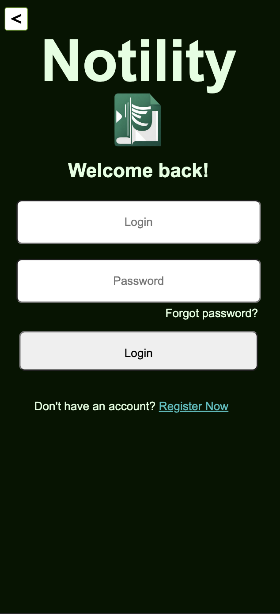

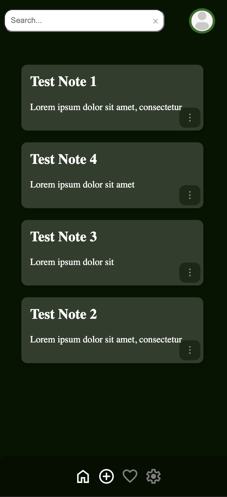

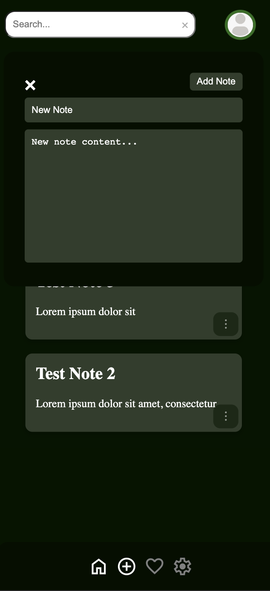

## Entity-Relationship Diagram (ERD)

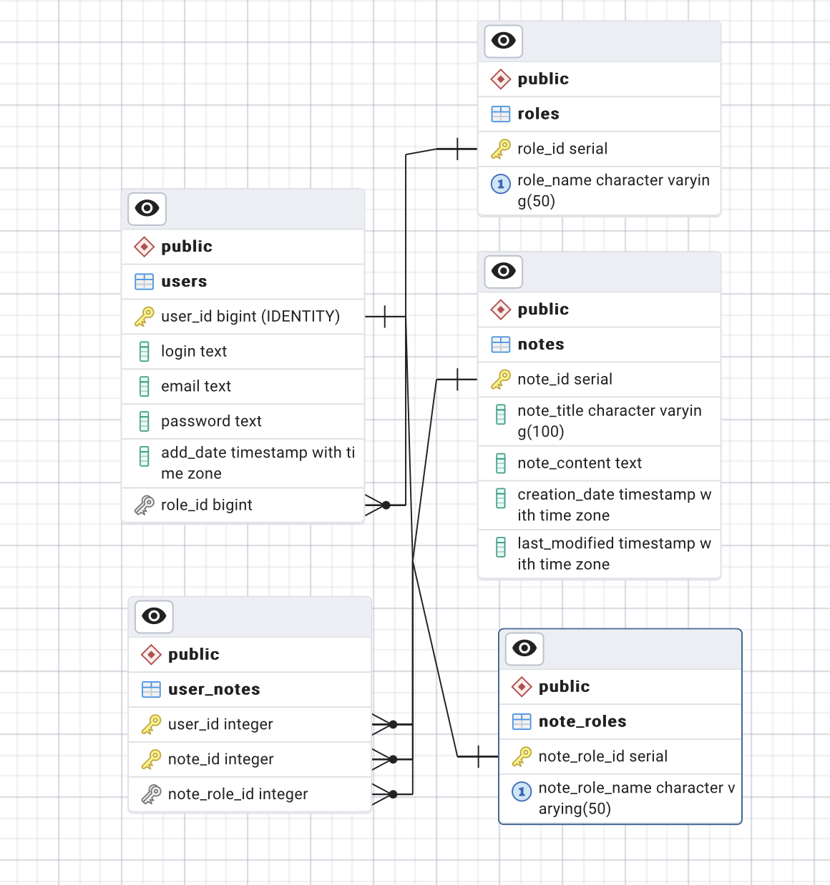

## Getting Started

### Prerequisites

- Docker

### Installation

1. Clone the repository:
   ```bash
   git clone https://github.com/kamdz01/WDPAI.git
   ```
2. Configure your database in `config.php`.

3. Run Docker Compose build:
   ```bash
   docker-compose build
   ```

4. Start Docker Compose:
   ```bash
   docker-compose start
   ```

5. Run Docker Compose:
   ```bash
   docker-compose up
   ```

6. Use pgAdmin to import provided db.sql database structure.

7. Add user roles and note roles to the database.

8. Visit `http://localhost:8080` in your web browser.

## Usage

Create an account to start creating and sharing notes. 

## Contributing

We warmly welcome contributions to the My Note App project! If you're interested in helping improve the app, here's how you can contribute:

### Reporting Issues

If you find bugs or have suggestions for new features:

1. Go to the [Issues](https://github.com/kamdz01/WDPAI/issues) page of the project on GitHub.
2. Check if the issue has already been reported.
3. If not, click the `New Issue` button.
4. Fill out the issue form with a detailed description of the bug or feature request.

### Submitting Changes

If you'd like to contribute to the codebase:

1. Fork the repository on GitHub.
2. Clone your fork to your local machine.
3. Create a new branch for your changes.
4. Make your changes in the new branch.
5. Commit your changes with clear, descriptive commit messages.
6. Push the branch to your GitHub fork.
7. Go to the GitHub page of the original project.
8. Click the Compare & pull request button for your branch.
9. Fill out the pull request form with a detailed description of your changes.
10. Click Create Pull Request.

## Authors

- **Kamil Dziedzic** - *Initial Work* - [kamdz01](https://github.com/kamdz01)

## License

Distributed under the GNU Affero General Public License (AGPL) version 3.0.

## Contact

**Kamil Dziedzic** - [kamdz01@gmail.com](mailto:kamdz01@gmail.com)